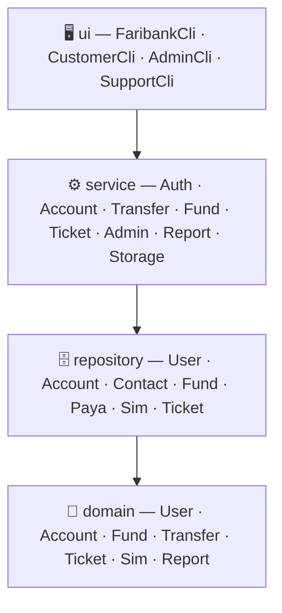

<div align="center">

# 🏦 Faribank
### Neo-Banking Core Platform — Phase 3 Verification Guide


</div>

Faribank is a modular Neo-Banking core platform built with **Java 17**, following **Clean Architecture** and **SOLID** principles, with a strict **PMD / CheckStyle** static-analysis gate on every class.

This document is a **verification guide**, not just an architecture overview. Every expected value quoted below — every fee, every balance, every round-up number — is taken directly from an assertion in the project's own JUnit test suite, or worked out by hand from the exact formula in the source. That means you can run the referenced test, or paste the matching JShell snippet, and reproduce the same number yourself. The last section also documents a few places where a feature is fully implemented and unit-tested but **not yet reachable from the running CLI** — worth knowing before you go looking for it interactively.

---

## 📚 Table of Contents

1. [Requirements](#-requirements)
2. [Getting Started](#-getting-started)
3. [Project Architecture](#️-project-architecture)
4. [Verifying Every Phase 3 Feature](#-verifying-every-phase-3-feature)
5. [Phase 10 — Full System Integration Test](#-phase-10--full-system-integration-test)
6. [Full Test Class Reference](#-full-test-class-reference)
7. [Running the Interactive CLI](#️-running-the-interactive-cli)
8. [Default Seed Data](#-default-seed-data)
9. [Exception Reference](#️-exception-reference)
10. [Verified Gaps — What's Implemented but Not Wired Up](#-verified-gaps--whats-implemented-but-not-wired-up)

---

## ✅ Requirements

| Tool | Version | Notes |
|---|---|---|
| JDK | 17 | `build.gradle` sets `sourceCompatibility = '17'` |
| Gradle Wrapper | 8.2 (bundled) | No local Gradle install needed — always use `./gradlew` / `.\gradlew.bat` |
| Git | any recent version | To clone the repository |

---

## 🚀 Getting Started

```bash
git clone git@github.com:mxed04/faribank.git
cd faribank
```

```bash
# Unix / macOS
./gradlew clean test

# Windows
.\gradlew.bat clean test
```

`build.gradle` only applies the `java` plugin (no `application` plugin), so there is no `./gradlew run` task. Build first and run the compiled entrypoint directly:

```bash
./gradlew compileJava
java -cp build/classes/java/main ir.ac.kntu.Main
```

---

## 🏗️ Project Architecture

```
src/main/java/ir/ac/kntu/
├── Main.java                     # Bootstraps BankServices + FaribankCli
├── domain/
│   ├── account/                  # Account, CreditCard, Transaction, TransactionType, TransferReceipt
│   ├── config/                   # SystemSettings — configurable fees, rates & taxes
│   ├── contact/                  # Contact — address book entries
│   ├── fund/                     # Fund (abstract), FundType, SavingsFund, RemainingFund, BonusFund
│   ├── report/                   # FinancialSummary
│   ├── sim/                      # SimCard, ChargeReceipt
│   ├── ticket/                   # Ticket, TicketSection, TicketStatus
│   ├── transfer/                 # TransferChannel, PayaRecord, PayaStatus
│   └── user/                     # User, Customer, CustomerSummary, AdminUser, SupportUser, SupportSection, KycStatus
├── repository/                   # AccountRepository, ContactRepository, FundRepository,
│                                  # PayaRepository, SimRepository, TicketRepository, UserRepository
├── service/                      # AccountService, AdminBatchService, AdminCustomerService, AdminService,
│                                  # AuthService, ContactService, FinancialReportService, FundService,
│                                  # InterestSchedulerService, JsonStorageService, SearchService,
│                                  # SettingsService, SimService, SupportService, TicketService, TransferService
├── ui/                           # FaribankCli (entry), CustomerCli, AdminCli, SupportCli,
│   └── report/                   # BankServices (DI container), ConsoleIo, AnsiColor, PaginationHelper,
│                                  # report/HtmlReportGenerator
├── util/                         # Calendar (simulated clock), PasswordValidator
└── exception/                    # FaribankException (root) + 8 domain-specific exceptions
```



---

## 🔍 Verifying Every Phase 3 Feature

For each feature below: **(a)** the exact automated test to run, quoting the real numbers it asserts, and **(b)** a manual `jshell` recipe wiring the same services by hand, so you can watch the same numbers come out step by step. All constructors and method names below are copied verbatim from the actual source.

Compile once before any `jshell` session:

```bash
./gradlew compileJava
jshell --class-path build/classes/java/main
```

### 1. Multi-Channel Transfer Switch

`TransferChannel` fees: `CARD_TO_CARD` = 300 fixed, `POL` = 2% of amount, `PAYA` = 2,000 fixed (queued), `FARI_TO_FARI` = free.

**Automated:** `./gradlew test --tests "ir.ac.kntu.service.MultiChannelTransferTest"`
Starting balances: Alice 500,000 / Bob 100,000.
- `transferCardToCard(alice, bobCard, 10000)` → fee **300** → Alice **489,700** / Bob **110,000**
- `transferPol(alice, bobAcc, 50000)` → fee **1,000** (2%) → Alice **449,000** / Bob **150,000**
- `transferFariToFari(alice, bobAcc, 25000)` → fee **0** → Alice **475,000** / Bob **125,000**
- `transferPaya(alice, bobAcc, 40000)` → fee **2,000**, queued as `PayaStatus.QUEUED` — Bob's balance is **not credited yet**

**Manual (jshell):**
```java
import ir.ac.kntu.repository.*;
import ir.ac.kntu.service.*;
import ir.ac.kntu.domain.user.*;
import ir.ac.kntu.domain.account.*;

var accountRepo = new AccountRepository();
var userRepo = new UserRepository();
var contactRepo = new ContactRepository();
var transfer = new TransferService(accountRepo, userRepo, contactRepo);

var alice = new Customer("Alice", "Brown", "09121110001", "1000000001", "Pass@1234");
alice.setKycStatus(KycStatus.APPROVED);
userRepo.saveCustomer(alice);
var accAlice = new Account("10011", alice.getPhoneNumber(), new CreditCard("6037100011112222"));
accAlice.deposit(500000.0);
alice.setAccount(accAlice);
accountRepo.save(accAlice);

var bob = new Customer("Bob", "Green", "09121110002", "1000000002", "Pass@1234");
bob.setKycStatus(KycStatus.APPROVED);
userRepo.saveCustomer(bob);
var accBob = new Account("10022", bob.getPhoneNumber(), new CreditCard("6037200033334444"));
accBob.deposit(100000.0);
bob.setAccount(accBob);
accountRepo.save(accBob);

transfer.transferCardToCard(alice.getPhoneNumber(), "6037200033334444", 10000.0).getFee(); // → 300.0
accAlice.getBalance();  // → 489700.0
accBob.getBalance();    // → 110000.0
```

---

### 2. Capital Investment Funds (Savings · Remaining round-up · Bonus)

`RemainingFund.computeRoundUp(amount)` = 75% of the distance from `amount` to the **nearer** power of 10.

**Automated:** `./gradlew test --tests "ir.ac.kntu.service.FundServiceTest"`
- `computeRoundUp(12340.0)` → nearest power is 10,000, diff 2,340 → **1,755.0**
- `computeRoundUp(9200.0)` → nearest power is 10,000, diff 800 → **600.0**
- `computeRoundUp(10000.0)` (exact power) → **0.0**
- `openSavingsFund(phone, 50000)` then `withdrawFromFund(fundId, 20000)` → fund balance **30,000**, account balance moves accordingly
- `openBonusFund(phone, 100000, 30, 0.15)` → immediate `withdrawFromFund` throws `ValidationException` (locked); `payAllMaturedInterests(now)` → **0** payouts; after +31 days → **1** payout, fund balance **115,000**

**Manual (jshell):**
```java
import ir.ac.kntu.domain.fund.RemainingFund;
RemainingFund.computeRoundUp(12340.0); // → 1755.0
RemainingFund.computeRoundUp(9200.0);  // → 600.0

var fundRepo = new FundRepository();
var fundService = new FundService(fundRepo, accountRepo, userRepo);
var bonus = fundService.openBonusFund(alice.getPhoneNumber(), 100000.0, 30, 0.15);
bonus.getBalance(); // → 100000.0
fundService.payAllMaturedInterests(ir.ac.kntu.util.Calendar.now()); // → 0 (not matured yet)
```
> To actually see the 30-day maturity fire without editing the system clock, use the `InterestSchedulerService` recipe in the next section — it accepts a custom time source.

---

### 3. Background Interest Scheduler

`InterestSchedulerService` wraps a `ScheduledExecutorService`. `start(delayMs, periodMs)` runs it on a real background thread; `runCycle()` runs one cycle synchronously (used by `AdminCli`'s "Distribute Profits").

**Automated:** `./gradlew test --tests "ir.ac.kntu.service.InterestSchedulerConcurrencyTest"`
- A `BonusFund` of 50,000 at 20% / 10 days: with the clock supplier returning **+12 days**, `runCycle()` → **1** payout, fund balance **60,000**, `getCycleCount()` → **1**
- A second test starts the scheduler on a real background thread (`start(10, 50)`) with a `CountDownLatch`-gated clock supplier returning **+35 days**, and confirms the **100,000 @ 15% / 30-day** fund reaches **115,000** automatically, with no code calling `runCycle()` directly

**Manual (jshell):**
```java
var scheduler = new InterestSchedulerService(fundService, () -> ir.ac.kntu.util.Calendar.now().plus(12, java.time.temporal.ChronoUnit.DAYS));
var bonus2 = fundService.openBonusFund(alice.getPhoneNumber(), 50000.0, 10, 0.20);
scheduler.runCycle();      // → 1
bonus2.getBalance();       // → 60000.0
```

---

### 4. Financial Analytics & HTML Statements

`FinancialReportService.calculateSummary` and `.generateHtmlStatement` both accept an optional `Instant` start/end range (pass `null, null` for all-time).

**Automated:** `./gradlew test --tests "ir.ac.kntu.service.FinancialReportServiceTest"`
- Charge +100,000, transfer out 30,000 (+300 fee), transfer in 20,000 → `getTotalInflow()` **120,000**, `getTotalOutflow()` **30,000**, `getTotalFees()` **300**, `getNetCashFlow()` **89,700** (`120,000 − 30,000 − 300`), `getRecordCount()` **3**
- Date-range filtering correctly excludes a transaction from 5 days ago when filtering to "last 1 day → now+5 days"
- `generateHtmlStatement(...)` output contains the literal strings `"Faribank Account Statement"`, the customer's full name, their account number, and the transaction's tracking number

**Manual (jshell):**
```java
var reportService = new FinancialReportService(accountRepo, userRepo);
var summary = reportService.calculateSummary(alice.getPhoneNumber(), null, null);
summary.getTotalOutflow(); // reflects whatever transfers you ran above
```

---

### 5. JSON State Persistence

`JsonStorageService(userRepo, accountRepo, fundRepo, ticketRepo)` exports/imports the full state as one JSON file.

**Automated:** `./gradlew test --tests "ir.ac.kntu.service.DataPersistenceTest"`
Exports a customer (balance 150,000), a `SavingsFund` (50,000), and a ticket to a temp file, then imports that file into **completely fresh repositories** and confirms every field round-trips exactly — including the customer's KYC status and the fund's balance.

**Manual (jshell):**
```java
import ir.ac.kntu.service.JsonStorageService;
var ticketRepo = new TicketRepository();
var storage = new JsonStorageService(userRepo, accountRepo, fundRepo, ticketRepo);
storage.exportToJsonFile("faribank_backup.json");

var freshUsers = new UserRepository();
var freshAccounts = new AccountRepository();
var freshFunds = new FundRepository();
var freshTickets = new TicketRepository();
new JsonStorageService(freshUsers, freshAccounts, freshFunds, freshTickets)
        .importFromJsonFile("faribank_backup.json");
freshAccounts.findByAccountNumber(accAlice.getAccountNumber()).get().getBalance(); // matches the original
```

---

### 6. SIM Card & Airtime Recharge

`SimService(simRepo, accountRepo, userRepo, settings)`. Tax is `SystemSettings.chargeTaxRate` (default **9%**), deducted on top of the recharge amount.

**Automated:** `./gradlew test --tests "ir.ac.kntu.service.SimServiceTest"`
- `buyCharge(buyerPhone, "09122222222", 10000.0)` → `getPureAmount()` **10,000**, `getTaxAmount()` **900** (9%), `getTotalAmount()` **10,900**; buyer's account debited **10,900**; `getSimBalance("09122222222")` → **10,000**; the account's first transaction has `TransactionType.SIM_CHARGE`
- Recharging a number **not yet registered** as a customer still persists the balance — a `Customer` created afterward with that phone number sees the same SIM balance
- Insufficient account balance → `InsufficientFundsException`; a target number not matching `^09\d{9}$` → `ValidationException`; zero/negative amount → `ValidationException`

**Manual (jshell):**
```java
import ir.ac.kntu.domain.config.SystemSettings;
import ir.ac.kntu.repository.SimRepository;

var simRepo = new SimRepository();
var settings = new SystemSettings();
var simService = new SimService(simRepo, accountRepo, userRepo, settings);

var receipt = simService.buyCharge(alice.getPhoneNumber(), "09122222222", 10000.0);
receipt.getTaxAmount();   // → 900.0
receipt.getTotalAmount(); // → 10900.0
simService.getSimBalance("09122222222"); // → 10000.0
```

---

### 7. Admin Governance & Hierarchy

`AdminService(userRepo)` — creator-lineage tracking and `isAncestor`-based block protection.

**Automated:** `./gradlew test --tests "ir.ac.kntu.service.AdminServiceTest"`
- `createAdmin("admin", adminB)` and `createSupport("admin", suppOne)` succeed; `assignSupportSections("admin", "supp1", Set.of(AUTH, FUNDS))` — `hasSection(AUTH)` and `hasSection(FUNDS)` are true, `hasSection(REPORT)` is false
- Re-registering the username `admin` → `UserAlreadyExistsException`
- `blockUser("admin", "admin")` (self-block) → `InvalidHierarchyOperationException`
- A 3-level chain `admin → admin2 → admin3`: `admin3` trying to block `admin2` or `admin` → `InvalidHierarchyOperationException` both times; `admin` blocking/unblocking `admin2` (its own child) succeeds normally

**Manual (jshell):**
```java
import ir.ac.kntu.domain.user.*;
import java.util.Set;

var adminUserRepo = new UserRepository(); // seeds root admin/Admin@1234 automatically
var adminService = new AdminService(adminUserRepo);

var admin2 = new AdminUser("Sub", "Admin", "admin2", "Pass@1234", "admin");
adminService.createAdmin("admin", admin2);
adminService.blockUser("admin2", "admin"); // → throws InvalidHierarchyOperationException (blocking an ancestor)
```

---

### 8. Admin Batch Operations & Customer Management

`AdminBatchService(payaRepo, accountRepo, fundService)`, `AdminCustomerService(userRepo)`.

**Automated:** `./gradlew test --tests "ir.ac.kntu.service.AdminOperationsTest"`
- Queue a 50,000 Paya transfer (fee 2,000) → Bob's balance stays at 100,000 until `settlePayaQueue(now)` runs, then it jumps to **150,000** and the record flips to `PayaStatus.PROCESSED`
- A 100,000 @ 20% / 30-day `BonusFund`, matured via `distributeFundProfits(future)` → balance **120,000**
- `searchCustomers("Miller", KycStatus.APPROVED, false)` finds exactly the one matching customer; an unknown name returns an empty list
- `setCustomerBlocked(phone, true)` → any subsequent transfer by that customer throws `ValidationException`; unblocking restores normal transfers
- `updateCustomerProfile(phone, "Robert", "Vance-Pharma")` updates first/last name and `getFullName()` together

---

### 9. Unified KYC Ticket Integration & Section Routing

`TicketService` supports both a 2-arg constructor (`ticketRepo, userRepo`, no KYC-approval wiring) and a 3-arg one (`ticketRepo, userRepo, authService`) that actually completes KYC on approval.

**Automated:** `./gradlew test --tests "ir.ac.kntu.service.TicketServiceTest"`
- `authService.registerCustomer(cust)` automatically opens one ticket with `isKycRequest() == true`, section `AUTH`, status `REGISTERED`
- A `SupportUser` scoped to `{TRANSFER, SETTINGS}` sees exactly those tickets via `getTicketsForSupport`, never an `AUTH` ticket
- The same operator calling `filterTicketsForSupport(..., TicketSection.AUTH, ...)` → `UnauthorizedSectionAccessException`
- An `AUTH`-scoped operator calling `approveKycTicket(username, ticketId)` → ticket status becomes `APPROVED`, and (because `authService` was passed to this `TicketService`) the customer's KYC flips to `APPROVED` with an account issued; `rejectKycTicket(...)` closes the ticket and sets `KycStatus.REJECTED`

> ⚠️ See the last section — the live `SupportCli` does **not** go through this section-scoped path at all.

---

### 10. Pagination

`PaginationHelper<T>(items, pageSize)` — standard 10-item windows used everywhere in `CustomerCli`/`AdminCli`.

**Automated:** `./gradlew test --tests "ir.ac.kntu.ui.PaginationHelperTest"`
- 25 items, page size 10 → 3 pages; page 1 and 2 have 10 items each, page 3 has 5; `nextPage()`/`previousPage()`/`setPage(n)` all bounds-check correctly (`setPage(99)` returns `false` and doesn't move)
- An empty list still reports 1 total page, with `hasNextPage()`/`hasPrevPage()` both `false`
- Page size `0` or negative → `ValidationException`

### 11. System Settings Bounds

**Automated:** `./gradlew test --tests "ir.ac.kntu.domain.config.SystemSettingsTest"` — confirms defaults (card fee 300, POL 2%, Paya fee 2000, Fari fee 0, reward rate 15%, SIM tax 9%) and that every rate setter rejects values outside `[0, 1]` (or negative fixed fees) with `ValidationException`.

---

### 12. Concurrency & Deadlock Safety

`Account` uses synchronized `deposit`/`withdraw`/`debit`/`credit`, and `TransferService` acquires both accounts' locks in a deterministic order (by account number) before moving money — so two transfers going in opposite directions between the same two accounts can never deadlock.

**Automated:** `./gradlew test --tests "ir.ac.kntu.service.TransferConcurrencyTest"`
- Alice and Bob both start at 500,000. **40 threads** fire simultaneously (20 Alice→Bob, 20 Bob→Alice, 1,000 IRR each via `transferByAccount`'s 0.5% fee) behind a `CountDownLatch`, on a 40-thread pool. The test asserts the whole batch finishes within **10 seconds** (i.e., it never deadlocks) and that all **40** transfers succeed.
- Net result — 20 outgoing at `1,000 + 5` fee and 20 incoming at `1,000` — leaves **both** accounts at exactly **499,900.0** (`500,000 − 20×1,005 + 20×1,000`), proving no balance was lost or double-counted under contention.
- A second test fires **50 deposits and 50 withdrawals of 200** at the same account concurrently from a 10-thread pool; the balance returns to exactly its starting **500,000.0**, confirming `synchronized` correctly serializes every mutation.

**Manual (jshell)** — same idea, sequentially, to see the math without the threading:
```java
accAlice.deposit(1000.0);
accAlice.withdraw(1005.0); // simulate one outgoing leg (1000 + 5 fee) by hand
accAlice.getBalance();
```

---

## 🧵 Phase 10 — Full System Integration Test

`FullSystemFlowIntegrationTest` (`src/test/java/ir/ac/kntu/system/FullSystemFlowIntegrationTest.java`) chains almost everything above into one continuous scenario instead of testing each service in isolation:

```bash
./gradlew test --tests "ir.ac.kntu.system.FullSystemFlowIntegrationTest"
```

1. Register a customer → automatic `AUTH` KYC ticket → `authService.approveKyc` → account + card issued
2. Deposit 5,000,000 into the sender's account; register and approve a second customer as recipient
3. Run all reachable transfer channels: Fari-to-Fari (fee 0), Card-to-Card (fee 300), Paya (fee 2,000, queued) — then clear the queue with `AdminBatchService.settlePayaQueue`
4. Open a `RemainingFund` and a `BonusFund` (1,000,000 @ 12% / 30 days)
5. Advance the clock **+35 days** via a custom `InterestSchedulerService` time source and call `runCycle()` → confirms the bonus fund's interest is paid automatically
6. Build a `FinancialSummary` and an HTML statement for the sender, and check the HTML contains their name and the literal statement title
7. `exportToJsonFile` the whole system, then `importFromJsonFile` it into a **brand-new** `BankServices()` instance and confirm the restored account balance matches exactly
8. Create a support ticket, reply to it, and confirm it closes with the reply text stored

A second, smaller test in the same file (`testAdminAndCreatorHierarchyModel`) checks `AdminUser.getCreatorAdmin()` directly, independent of the rest of the flow.

---

## 🧪 Full Test Class Reference

91 `@Test` methods run across 24 classes:

| Test Class | Feature |
|---|---|
| `DomainModelTest` | Core entity invariants |
| `SystemSettingsTest` | Fee/rate bounds validation |
| `AuthServiceTest` | Registration, login, KYC lifecycle |
| `AccountServiceTest` | Deposits, balances, ledger filtering |
| `TransferServiceTest`, `MultiChannelTransferTest`, `TransferConcurrencyTest` | Transfers, fees, 40-thread deadlock-free concurrency |
| `FundServiceTest`, `InterestSchedulerConcurrencyTest` | Capital funds, round-up math, interest scheduling |
| `SimServiceTest` | SIM recharge, tax, unregistered-number persistence |
| `TicketServiceTest`, `SupportServiceTest` | Ticketing, section routing, customer search |
| `AdminServiceTest`, `AdminOperationsTest` | Admin hierarchy, batch settlement, customer management |
| `FinancialReportServiceTest` | Cash-flow analytics, HTML statement content |
| `DataPersistenceTest` | JSON export/import fidelity |
| `SearchServiceTest` | Fuzzy/string-similarity search |
| `PaginationHelperTest`, `ConsoleIoTest`, `CliIntegrationTest` | CLI plumbing |
| `HtmlReportGeneratorTest` | Standalone HTML statement rendering |
| `CheckPMDTest`, `CheckStyleTest` | Static analysis gates (0 violations expected) |
| `FullSystemFlowIntegrationTest` *(Phase 10)* | End-to-end flow across every module above |

`CheckPMDTest`/`CheckStyleTest` are plain JUnit tests that invoke the PMD/Checkstyle libraries programmatically — there is no separate `./gradlew pmdMain`/`checkstyleMain` task; running them is just `./gradlew test --tests "ir.ac.kntu.style.CheckPMDTest"` etc.

---

## 🖥️ Running the Interactive CLI

`FaribankCli` (the actual `Main` entrypoint) only offers three top-level options: **Customer Login**, **Customer Registration**, and **Support Operator Login**. From there:

- **Customer session** (`CustomerCli`) reaches: account ledger, all four transfer channels, all three fund types, financial analytics/HTML export, contacts, tickets (plain create/view), and settings.
- **Support session** (`SupportCli`) reaches: pending-KYC approve/reject (calls `AuthService` directly), ticket list + reply, and customer search.
- There is **no menu option to log in as an `AdminUser`** — see the last section for what that means in practice, and how to reach `AdminCli` anyway.

---

## 🔑 Default Seed Data

| Item | Value |
|---|---|
| Root Admin | `username: admin` / `password: Admin@1234` (seeded automatically by `UserRepository`) |
| First account number issued | `100001` (via `AuthService.ACC_COUNTER`, increments per KYC approval) |
| First auto-generated KYC ticket ID | `KYC-1001` |
| First manually-created ticket ID | `TCK-5001` |
| Phone number format | `09XXXXXXXXX` (used by `SimCard`'s `^09\d{9}$` validation) |

---

## ⚠️ Exception Reference

```
RuntimeException
 └── FaribankException                      (root)
      ├── ValidationException                general invariant/business-rule violations
      ├── AuthenticationException            invalid login credentials
      ├── UserAlreadyExistsException          duplicate phone/national code on registration
      ├── AccountNotFoundException            missing account, or KYC not approved
      ├── InsufficientFundsException          balance < amount + fee
      ├── TicketNotFoundException             unknown ticket ID
      ├── UnauthorizedSectionAccessException  operator acting outside their assigned section(s)
      └── InvalidHierarchyOperationException  admin violating creator/ancestor hierarchy rules
```

---

## 🔬 Verified Gaps — What's Implemented but Not Wired Up

These were found by reading `Main.java`, `FaribankCli.java`, `BankServices.java`, and every CLI class directly (grep for where each service is actually constructed and called) — not by guessing. They don't affect the test suite (`./gradlew test` still passes cleanly), but they matter if you're trying to reach a feature by *running* the app rather than testing it:

| # | Finding |
|---|---|
| 1 | **`AdminCli` — and therefore `AdminUser` login — is unreachable from `Main`.** `FaribankCli` has exactly three menu options (Customer Login / Registration / Support Login); nothing in it ever calls `AuthService.authenticateAdmin` or constructs an `AdminCli`. The only place `AdminCli` is ever instantiated outside its own class is `CliIntegrationTest`, which builds one directly with a hand-made `AdminUser` and a scripted `Scanner`, bypassing the login flow entirely. |
| 2 | **`SimService`/`SimRepository` are not part of `BankServices` at all.** They're fully implemented and covered by `SimServiceTest`, but `BankServices` never imports or constructs either one, so SIM recharge is unreachable from any running CLI session. |
| 3 | **`AdminService` (the creator-lineage hierarchy service) is also absent from `BankServices`.** `AdminBatchService` and `AdminCustomerService` are wired in, but `AdminService.createAdmin/createSupport/assignSupportSections/isAncestor/blockUser` only exists in isolation in `AdminServiceTest` — there's currently no way to create a second admin or assign support sections through the running app. |
| 4 | **The section-scoped KYC ticket workflow (`TicketService.getTicketsForSupport`/`approveKycTicket`/`rejectKycTicket`) is bypassed by the live `SupportCli`.** `SupportCli.handleKyc()` calls `AuthService.approveKyc`/`rejectKyc` directly instead. This matters because `BankServices`'s default constructor also wires `TicketService` with its 2-arg constructor (`new TicketService(ticketRepo, userRepo)`), leaving its internal `authService` reference `null` — so even if something did call `TicketService.approveKycTicket` in production, it would flip the ticket's status but silently skip actually approving the customer's KYC (the method guards that call with `if (authService != null)`). |
| 5 | **`SupportCli.handleUserSearch()` passes the same single query string as phone, first name, *and* last name** to `SupportService.searchCustomers(query, query, query)`. Searching by phone-only or name-only will typically return no results unless the same text happens to also be a substring of the other fields. |
| 6 | **No maximum per-transaction amount is enforced anywhere.** `TransferChannel.calculateFee` only ever adds a fixed fee and/or a percentage — there's no ceiling check in `TransferService` or `TransferChannel`. (Earlier project notes floated specific IRR caps per channel; they aren't present in this codebase.) |

None of these block the build or the automated suite — they're exactly the kind of thing this verification guide exists to surface before a live demo.